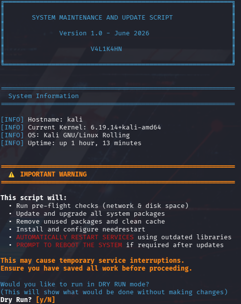
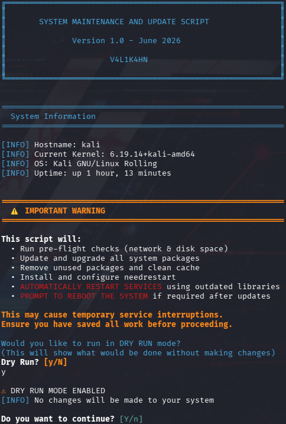
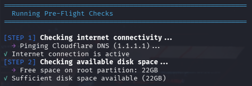
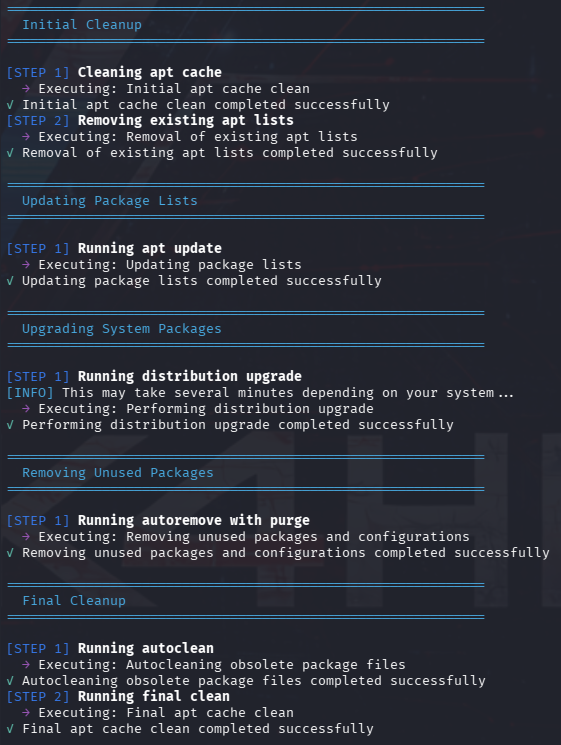
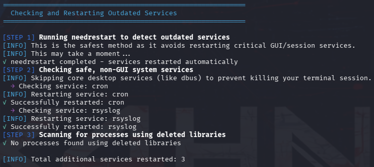
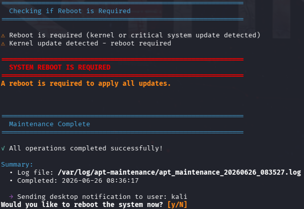
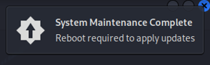

# System Maintenance and Update Script


A comprehensive system-maintenance script for Debian-based Linux distributions. It automates package updates, package cleanup, service restarts, reboot detection, logging and desktop notifications through a structured, interactive terminal interface.

> [!WARNING]
> This script performs privileged package-management and service-management operations. Review the source code, save all work and ensure that you have a reliable backup before running it on a production system.

## Table of Contents

- [Features](#features)
- [Screenshots](#screenshots)
- [Requirements](#requirements)
- [Installation](#installation)
- [Usage](#usage)
- [Maintenance Workflow](#maintenance-workflow)
- [Logging](#logging)
- [Configuration Changes](#configuration-changes)
- [Dry-Run Behaviour](#dry-run-behaviour)
- [Reboot Detection](#reboot-detection)
- [Troubleshooting](#troubleshooting)
- [Security Considerations](#security-considerations)
- [Known Limitations](#known-limitations)
- [Licence](#licence)
- [Support](#support)
- [File Integrity Verification](#file-integrity-verification)
- [Version History](#version-history)

## Features

- **Root privilege validation** - Stops immediately unless the script is run as `root`.
- **Pre-flight checks** - Tests connectivity to `1.1.1.1` and verifies that at least 1 GB is available on the root partition.
- **Package-list refresh** - Removes existing APT lists and runs `apt update`.
- **Distribution upgrade** - Runs `apt dist-upgrade -y`.
- **Package cleanup** - Runs `apt autoremove --purge -y`, `apt autoclean -y` and `apt clean`.
- **Automatic retry handling** - Retries selected maintenance commands up to three times.
- **Corrective package actions** - Removes stale APT and DPKG lock files and runs `dpkg --configure -a` between retries.
- **Service management** - Installs and configures `needrestart`, then checks for services using outdated libraries.
- **Selected service restarts** - Attempts to restart active `cron`, `rsyslog`, `sshd` and `cups` services.
- **Deleted-library scan** - Uses `lsof +L1` when `lsof` is available.
- **Structured terminal output** - Uses headings, progress indicators, status messages and ANSI colours.
- **Timestamped logging** - Stores logs under `/var/log/apt-maintenance/`.
- **Log rotation** - Creates a weekly `logrotate` policy that retains four rotations.
- **Desktop notifications** - Attempts to notify the original non-root desktop user through `notify-send`.
- **Reboot detection** - Checks Debian reboot marker files and compares the running kernel with the newest kernel image under `/boot`.
- **Interactive reboot prompt** - Offers to reboot when the script determines that a restart is required.
- **Dry-run selection** - Provides a user-selectable simulation mode for commands routed through the main execution wrapper.

## Screenshots

Store screenshots in the repository's `images` directory using the filenames shown below.

### Initial Screen and System Information



### Warning and Confirmation



### Pre-Flight Checks



### Package Update Process



### Service Management



### Reboot Prompt



### Desktop Notification



## Requirements

### Supported Systems

The script is intended for Debian-based Linux distributions that use APT and systemd, including:

- Debian
- Ubuntu
- Kali Linux
- Compatible Debian-derived distributions

### Core Requirements

| Requirement | Details |
|---|---|
| Privileges | Root access through `sudo`, `su` or direct root login |
| Shell | Bash 4.0 or later |
| Package manager | APT and DPKG |
| Init system | systemd for service checks and restarts |
| Network | Connectivity to package repositories and ICMP access to `1.1.1.1` |
| Disk space | At least 1 GB free on `/` |
| Kernel files | `/boot/vmlinuz-*` for kernel-version comparison |

## Installation

### Option 1: Clone the Repository

```bash
git clone https://github.com/Valikahn/apt-maintenance.git
cd apt-maintenance
chmod +x system_maintenance.sh
```

### Option 2: Download the Script Directly

```bash
wget https://raw.githubusercontent.com/Valikahn/apt-maintenance/main/system_maintenance.sh
chmod +x system_maintenance.sh
```

## Usage

### Recommended Command

```bash
sudo ./system_maintenance.sh
```

### Run from a Root Shell

```bash
su -c './system_maintenance.sh'
```

### Interactive Prompts

The script presents the following prompts:

1. **Dry-run mode** - Select whether wrapped maintenance commands should be simulated.
2. **Confirmation** - Confirm whether maintenance should continue.
3. **Reboot** - When a reboot is considered necessary, choose whether to reboot immediately.

The default choices are:

- Dry run: **No**
- Continue: **Yes**
- Reboot now: **No**

## Maintenance Workflow

### 1. Privilege Check

The script verifies that the effective user ID is `0`. It exits before initialisation when root privileges are unavailable.

### 2. Logging Initialisation

The script creates:

```text
/var/log/apt-maintenance/
```

It then generates a timestamped log filename in this format:

```text
/var/log/apt-maintenance/apt_maintenance_YYYYMMDD_HHMMSS.log
```

### 3. Log-Rotation Configuration

When the configuration does not already exist, the script creates:

```text
/etc/logrotate.d/apt-maintenance
```

The policy:

- Rotates logs weekly
- Retains four rotations
- Compresses rotated files
- Delays compression by one cycle
- Ignores missing and empty files
- Creates new logs with mode `0640` and ownership `root:root`

### 4. System Information

The script displays:

- Hostname
- Running kernel
- Operating-system description
- System uptime

### 5. User Confirmation

A warning explains that the script will update packages, remove unused packages, configure `needrestart`, restart services and potentially offer a reboot.

### 6. Pre-Flight Checks

The script:

1. Sends one ICMP echo request to Cloudflare's `1.1.1.1` address, with a five-second timeout.
2. Reads available space on `/`.
3. Exits when less than `1,048,576 KB` - approximately 1 GB - is available.

### 7. `needrestart` Installation and Configuration

The script installs `needrestart` through:

```bash
apt-get install -y needrestart
```

It backs up the existing configuration, where present, using a timestamped suffix:

```text
/etc/needrestart/needrestart.conf.bak.YYYYMMDD_HHMMSS
```

It then sets:

```perl
$nrconf{restart} = 'a';
```

This selects automatic restart mode.

### 8. Initial APT Cleanup

The script runs:

```bash
apt clean
rm -rf /var/lib/apt/lists/*
```

### 9. Package-List Update

The script runs:

```bash
apt update
```

### 10. Distribution Upgrade

The script runs:

```bash
apt dist-upgrade -y
```

### 11. Unused-Package Removal

The script runs:

```bash
apt autoremove --purge -y
```

### 12. Final Cleanup

The script runs:

```bash
apt autoclean -y
apt clean
```

### 13. Service Management

The script runs:

```bash
needrestart -b -r a
```

It then checks the following services and attempts to restart each one when active:

```text
cron
rsyslog
sshd
cups
```

The script deliberately avoids directly restarting core desktop services such as D-Bus.

### 14. Deleted-Library Scan

When `lsof` is installed, the script scans for open deleted files associated with shared libraries:

```bash
lsof +L1
```

Detected process names are printed for review.

### 15. Reboot Evaluation

The script checks:

```text
/var/run/reboot-required
/var/run/reboot-required.pkgs
```

It also compares:

```bash
uname -r
```

with the newest matching file under:

```text
/boot/vmlinuz-*
```

### 16. Completion and Notification

The final summary displays:

- Log-file path
- Completion timestamp
- Dry-run status, when applicable

The script then attempts to send a desktop notification to the original non-root user.

## Logging

### Log Location

```text
/var/log/apt-maintenance/
```

### View the Most Recent Log

```bash
sudo ls -1t /var/log/apt-maintenance/*.log | head -1
```

### Follow the Most Recent Log

```bash
sudo tail -f "$(sudo ls -1t /var/log/apt-maintenance/*.log | head -1)"
```

### List All Logs

```bash
sudo ls -lh /var/log/apt-maintenance/
```

### Search for Errors

```bash
sudo grep -R "\[ERROR\]" /var/log/apt-maintenance/
```

## Configuration Changes

The script may create or modify the following locations:

| Path | Purpose |
|---|---|
| `/var/log/apt-maintenance/` | Maintenance logs |
| `/etc/logrotate.d/apt-maintenance` | Log-rotation policy |
| `/etc/needrestart/needrestart.conf` | Automatic service-restart configuration |
| `/etc/needrestart/needrestart.conf.bak.*` | Timestamped configuration backups |
| `/var/lib/apt/lists/` | APT package-list data removed and rebuilt by the script |
| `/var/cache/apt/archives/` | APT cache cleaned during maintenance |

## Dry-Run Behaviour

> [!CAUTION]
> Version 1.0 does not provide a completely side-effect-free dry run.

Commands passed through `execute_with_correction()` are simulated when dry-run mode is enabled. This includes the main APT cleanup, update, upgrade and autoremove commands.

However, some operations occur outside that wrapper. In the current implementation, the script may still:

- Create `/var/log/apt-maintenance/`
- Create `/etc/logrotate.d/apt-maintenance`
- Write a log file
- Run the network and disk-space checks
- Install `needrestart` if it is absent
- Back up and modify `/etc/needrestart/needrestart.conf`

The service-restart function itself recognises dry-run mode and skips service restarts.

For a strictly non-modifying preview, inspect the source code manually or run the script only inside a disposable virtual machine or snapshot-backed test environment.

## Reboot Detection

A reboot is reported as required when any of the following is true:

- `/var/run/reboot-required` exists.
- `/var/run/reboot-required.pkgs` contains a package name matching `linux`.
- The running kernel does not match the newest `/boot/vmlinuz-*` entry.

> [!NOTE]
> Comparing the running kernel with the newest filename in `/boot` is a useful heuristic, but custom kernel naming, rescue kernels or unusual boot configurations may produce a false positive.

## Troubleshooting

### Root Privileges Required

**Message:**

```text
ERROR: ROOT REQUIRED
```

**Resolution:**

```bash
sudo ./system_maintenance.sh
```

### No Internet Connection Detected

The script tests `1.1.1.1` with `ping`. The check can fail even when package repositories are reachable if ICMP is blocked by a firewall, VPN, container platform or network policy.

Test manually:

```bash
ping -c 1 -W 5 1.1.1.1
```

Also test repository access:

```bash
sudo apt update
```

### Insufficient Disk Space

Check free space:

```bash
df -h /
```

Locate large directories:

```bash
sudo du -xhd1 / | sort -h
```

Free at least 1 GB before trying again.

### APT or DPKG Failure

Inspect the latest log:

```bash
sudo tail -n 200 "$(sudo ls -1t /var/log/apt-maintenance/*.log | head -1)"
```

Check package-manager state:

```bash
sudo dpkg --configure -a
sudo apt --fix-broken install
```

### `needrestart` Installation Failure

Try installing it manually:

```bash
sudo apt update
sudo apt install needrestart
```

### Desktop Notification Not Displayed

Desktop notification failure is non-fatal. Confirm that `notify-send` is available:

```bash
command -v notify-send
```

Install it when required:

```bash
sudo apt install libnotify-bin
```

Notifications also require an active graphical user session and access to that user's D-Bus session bus.

### A Service Fails to Restart

Inspect its status and journal:

```bash
sudo systemctl status SERVICE_NAME
sudo journalctl -u SERVICE_NAME --since "30 minutes ago"
```

Replace `SERVICE_NAME` with the affected unit.

### SSH Service Name Differs

Some Debian-based systems use `ssh.service` rather than `sshd.service`. The current script checks `sshd`, so SSH may not be restarted on those systems.

Check the installed unit:

```bash
systemctl status ssh
systemctl status sshd
```

### Script Terminates after a Signal

The script handles `INT`, `TERM` and `HUP` signals through a trap. Review the maintenance log to identify the last completed action.

## Security Considerations

- Review the script before execution:

  ```bash
  less system_maintenance.sh
  ```

- Run it only from a trusted source.
- Verify the repository URL and downloaded file before granting execute permission.
- Consider validating a published checksum or signed release when one is available.
- Do not run the script across an unreliable remote SSH connection without an out-of-band recovery method.
- Use a virtual-machine snapshot, filesystem snapshot or tested backup before major upgrades.
- Be aware that removing APT and DPKG lock files can be unsafe when another package-management process is genuinely active.
- Automatic service restarts can interrupt active sessions, jobs and network services.
- Review changes to `/etc/needrestart/needrestart.conf`, particularly on servers with strict change-control requirements.
- The script uses configured APT repositories; it does not independently verify that every configured repository is official.

## Known Limitations

- Dry-run mode is not fully non-modifying.
- Internet validation depends on ICMP access to `1.1.1.1`.
- The script assumes APT, DPKG and systemd are available.
- It does not detect whether another package-management process is legitimately running before deleting lock files during retry recovery.
- It uses `eval` to execute command strings. The current commands are defined internally, but future contributors should avoid passing untrusted input into the execution wrapper.
- It does not stop the overall workflow when every wrapped command fails; individual return values are not consistently checked by the main routine.
- The final message can report that all operations completed successfully even when one or more non-fatal steps failed.
- `needrestart` configuration is modified directly and persists after the script finishes.
- The manually selected service list may not match service names on every Debian-derived distribution.
- Desktop notifications depend on the original user's graphical session and D-Bus environment.
- Kernel comparison is based on filename ordering rather than the active bootloader selection.
- The script does not create a filesystem or virtual-machine snapshot.
- The script does not itself install `lsof`, `notify-send` or `logrotate`.

## Licence

This project is licensed under the GNU General Public License v3.0. See the [LICENSE](LICENSE) file for details.

## Support

For issues, questions or suggestions:

- Open an issue in the [GitHub issue tracker](https://github.com/Valikahn/apt-maintenance/issues).
- Search existing issues before creating a new report.
- Include the operating-system version, script version and relevant redacted log output.

Do not publish logs containing hostnames, usernames, internal addresses or other sensitive system details without reviewing and redacting them first.

## File Integrity Verification

The checksums below allow users to confirm that their downloaded copy of `system_maintenance.sh` matches the original file published with this release.

> [!IMPORTANT]
> A matching checksum confirms file integrity only. It shows that the downloaded file is identical to the published version, but it does not independently prove authorship. Always obtain the script and checksum values from the official repository or release page.

### Published Checksums

| Algorithm   | Checksum                                                                                                                           |
| ----------- | ---------------------------------------------------------------------------------------------------------------------------------- |
| **MD5**     | `544742ed0f0601840c90d8008aff3f89`                                                                                                 |
| **SHA-1**   | `995090643a0485cc4d41c8bceb36e6a97e33795e`                                                                                         |
| **SHA-256** | `f5e829f87ab629ab2ac703313e9742448da18bb39ecf90d846d0690ef0006fb1`                                                                 |
| **SHA-384** | `48912397743009e9b396b2f9ef97588024a89d8a7ac4b7c145130e05aac664389de94f8f448750d0744c2c71c8c6af25`                                 |
| **SHA-512** | `fbede314c391a5ae4f2b5357db966a6c776fa102625e2ff307f7f03d61f4eb8391f951463fb6da61c0e708954e04ef75c8b1a59775665f323d77aa28cdfc1868` |
| **BLAKE2b** | `41eb50e3237a692c9d06e4ad3baa3518d042becd1796b909fc80f6f62a82e103d587aca4e14e8132ef5f461fe7862c5b65faf536a0be3f212de93772fe5c98a3` |

SHA-256 is recommended for routine integrity verification. MD5 and SHA-1 are included only for legacy compatibility and should not be relied upon for security-sensitive validation.

### Calculate the Checksums

From the directory containing `system_maintenance.sh`, run:

```bash
md5sum system_maintenance.sh
sha1sum system_maintenance.sh
sha256sum system_maintenance.sh
sha384sum system_maintenance.sh
sha512sum system_maintenance.sh
b2sum system_maintenance.sh
```

Compare each calculated value with the corresponding published checksum above.

### Automatic SHA-256 Verification

Run the following command to verify the file automatically:

```bash
echo "f5e829f87ab629ab2ac703313e9742448da18bb39ecf90d846d0690ef0006fb1  system_maintenance.sh" | sha256sum --check
```

A successful verification displays:

```text
system_maintenance.sh: OK
```

A failed verification displays:

```text
system_maintenance.sh: FAILED
```

Do not execute the script when verification fails. Delete the file, download it again from the official repository and repeat the check.

### Verify All Published Checksums

The following commands validate the file against every published checksum:

```bash
echo "544742ed0f0601840c90d8008aff3f89  system_maintenance.sh" | md5sum --check
echo "995090643a0485cc4d41c8bceb36e6a97e33795e  system_maintenance.sh" | sha1sum --check
echo "f5e829f87ab629ab2ac703313e9742448da18bb39ecf90d846d0690ef0006fb1  system_maintenance.sh" | sha256sum --check
echo "48912397743009e9b396b2f9ef97588024a89d8a7ac4b7c145130e05aac664389de94f8f448750d0744c2c71c8c6af25  system_maintenance.sh" | sha384sum --check
echo "fbede314c391a5ae4f2b5357db966a6c776fa102625e2ff307f7f03d61f4eb8391f951463fb6da61c0e708954e04ef75c8b1a59775665f323d77aa28cdfc1868  system_maintenance.sh" | sha512sum --check
echo "41eb50e3237a692c9d06e4ad3baa3518d042becd1796b909fc80f6f62a82e103d587aca4e14e8132ef5f461fe7862c5b65faf536a0be3f212de93772fe5c98a3  system_maintenance.sh" | b2sum --check
```

All six commands should return:

```text
system_maintenance.sh: OK
```

> [!NOTE]
> Any change to the script, including whitespace, comments or line endings, will produce different checksum values. Update the published checksums whenever the file changes.

## Version History

### Version 1.0 - Current

- Initial public release
- Added root privilege validation
- Added pre-flight network and disk-space checks
- Added automated APT update, distribution upgrade and package cleanup
- Added retry handling and corrective DPKG actions
- Added `needrestart` installation and automatic service-restart configuration
- Added selected system-service restarts
- Added deleted-library scanning through `lsof`
- Added timestamped logging and automated log rotation
- Added desktop notifications
- Added reboot detection and an interactive reboot prompt
- Added interactive dry-run selection
- Added centralised version-control variables for the version, month and year

---

**Made with ❤️ by [Valikahn](https://github.com/Valikahn)**

⭐ If this project is useful, consider starring it on GitHub.
